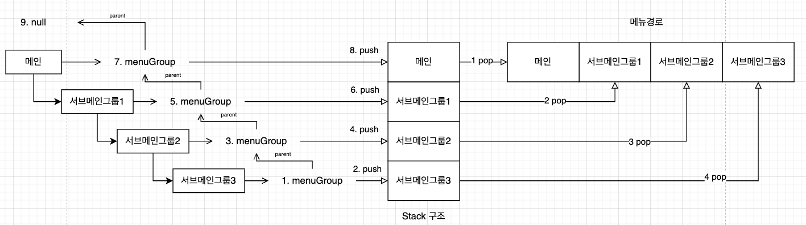
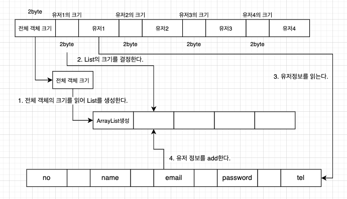
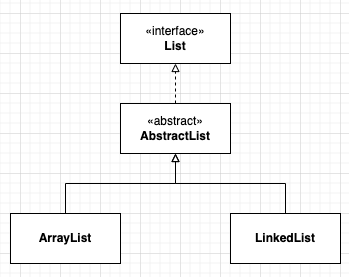
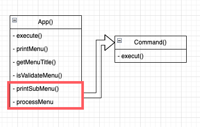

# UML
## UML이란?
- 

## UML case
- UML은 크게 6가지로 구분  할 수 있다.



# 실습프로젝트 리팩토링하기
## 인터페이스의 활용
- 기존 프로젝트의 List 항목들에서 중복된 코드를 줄이자.
- 다음가 같은 UML을 가지도록 수정 한다.

<p align ="center">

</p>

- 먼저 ArrayList와 LinkedList의 공통 코드를 추상 메소드(pulic abstract)로 선언한다.
``` java 
//List 인터페이스
public interface List {
  void add(Object obj);

  Object remove(int index);

  Object[] toArray();

  int indexOf(Object obj);

  int size();

  Object get(int index);
}
```

- 다음 ArrayList와 LinkedList의 동일한 코드를 Abstract class    로 오버라이딩을 한다.

```java 
public abstract class AbstractList implements List {
  protected int size = 0;

  @Override
  public int size() {
    return size;
  }
}
```

- 이후 ArrayList와 LinkedList의 상세코드를 오버라이딩으로 수정한다.

```java
public class ArrayList extends AbstractList {

  private static final int MAX_SIZE = 3;

  private Object[] list = new Object[MAX_SIZE];
  private int size = 0;

  @Override
  public void add(Object obj) {
    if (size == list.length) {
      int oldSize = list.length;
      int newSize = oldSize + (oldSize >> 1);
      list = Arrays.copyOf(list, newSize);
    }
    list[size++] = obj;
  }

  @Override
  public Object remove(int index) {
    if (index < 0 || index >= size) {
      return null;
    }
    Object deletedObj = list[index];
    for (int i = index + 1; i < size; i++) {
      list[i - 1] = list[i];
    }
    list[--size] = null;
    return deletedObj;
  }

  @Override
  public Object[] toArray() {
    Object[] arr = new Object[size];
    System.arraycopy(list, 0, arr, 0, arr.length);
    return arr;
  }

  @Override
  public int indexOf(Object obj) {
    for (int i = 0; i < size; i++) {
      if (list[i] == obj) {
        return i;
      }
    }
    return -1;
  }

  @Override
  public int size() {
    return size;
  }

  @Override
  public Object get(int index) {
    if (index < 0 || index >= size) {
      return null;
    }
    java.util.ArrayList l;
    return list[index];
  }

  public boolean contains(Object obj) {
    return indexOf(obj) != -1;
  }

}
```

```java
public class LinkedList extends AbstractList {

  Node first;
  Node last;
  int size;

  @Override
  public void add(Object value) {
    Node newNode = new Node(value);

    if (first == null) {
      last = first = newNode;
    } else {
      last.next = newNode;
      last = newNode;
    }
    size++;
  }

  @Override
  public Object get(int index) {
    if (index < 0 || index >= size) {
      return null;
    }

    Node cursor = first;
    int currentIndex = 0;

    while (cursor != null) {
      if (currentIndex == index) {
        return cursor.value;
      }
      cursor = cursor.next;
      currentIndex++;
    }
    return null;
  }

  @Override
  public Object remove(int index) {
    if (index < 0 || index >= size) {
      return null;
    }

    Node deletedNode = null;
    size--;

    if (index == 0) {
      deletedNode = first;
      first = first.next;
      if (first == null) {
        last = null;
      }
      return deletedNode.value;
    }

    Node cursor = first;
    int currentIndex = 0;

    while (cursor != null) {
      if (currentIndex == (index - 1)) {
        break;
      }
      cursor = cursor.next;
      currentIndex++;
    }

    deletedNode = cursor.next;
    cursor.next = cursor.next.next;

    if (cursor.next == null) {
      last = cursor;
    }

    return deletedNode.value;
  }

  @Override
  public int indexOf(Object value) {
    Node cursor = first;
    int currentIndex = 0;

    while (cursor != null) {
      if (cursor.value == value) {
        return currentIndex;
      }
      cursor = cursor.next;
      currentIndex++;
    }
    return -1;
  }

  @Override
  public Object[] toArray() {
    Object[] arr = new Object[size];

    Node cursor = first;
    for (int i = 0; i < size; i++) {
      arr[i] = cursor.value;
      cursor = cursor.next;
    }

    return arr;
  }

  @Override
  public int size() {
    return size;
  }
}
```

## 리팩토링: GRASP의 High Cohesion
- High Cohesion :  응집력은 클래스나 모듈의 내부 요소들이 얼마나      밀접하게 관련되어 있는지를 나타내는 개념
- 관련성 높은 기능들의 집합
- 유지보수성 향상
- 재사용성 향상
- 객체지향 원칙 준수

### App과 Command 코드 수정
- App에 subMenus에서 수행하는 기능들 혼재
- APP에 있는 subMenus들의 기능을 각 Command 기능으로 옮기기



- App()코드수정
```java 

public class App {
  
  String[] mainMenus = new String[] {"회원", "프로젝트", "게시판", "공지사항", "도움말", "종료"};
  UserCommand userCommand = new UserCommand("회원");
  BoardCommand boardCommand = new BoardCommand("게시판");
  BoardCommand noticeCommand = new BoardCommand("공지사항");
  ProjectCommand projectCommand = new ProjectCommand("프로젝트", userCommand.getUserList());


  public static void main(String[] args) {
    new App().execute();
  }

  void execute() {
      //생략
  }

  void processMenu(String menuTitle) {
    switch (menuTitle) {
      case "회원":
        userCommand.execute();
        break;
      case "프로젝트":
        projectCommand.execute();
        break;
      case "게시판":
        boardCommand.execute();
        break;
      case "공지사항":
        noticeCommand.execute();
        break;
      case "도움말":
        System.out.println("도움말입니다.");
        break;
      default:
        System.out.printf("%s 메뉴의 명령을 처리할 수 없습니다.\n", menuTitle);
    }
  }

  void printMenu() {
      //생략
  }
  
  boolean isValidateMenu(int menuNo, String[] menus) {
      //생략
  }

  String getMenuTitle(int menuNo, String[] menus) {
      //생략
  }
}
```
- Command()인터페이스 생성
```java
public interface Command {
  void execute();
}

```
- Command()코드수정

```java
public class UserCommand implements Command {

  LinkedList userList = new LinkedList();

  String menuTitle;
  String[] menus = {"등록", "목록", "조회", "변경", "삭제"};

  public UserCommand(String menuTitle) {
    this.menuTitle = menuTitle;
  }

  @Override
  public void execute() {
    printMenus();
    while (true) {
      String command = Prompt.input(String.format("메인/%s>", menuTitle));
      if (command.equals("menu")) {
        printMenus();
        continue;
      } else if (command.equals("9")) { // 이전 메뉴 선택
        break;
      }
      try {
        int menuNo = Integer.parseInt(command);
        String menuName = getMenuTitle(menuNo);
        if (menuName == null) {
          System.out.println("유효한 메뉴 번호가 아닙니다.");
          continue;
        }
        processMenu(menuName);
      } catch (NumberFormatException ex) {
        System.out.println("숫자로 메뉴 번호를 입력하세요.");
      }
    }
  }

  private void processMenu(String menuName) {
    System.out.printf("[%s]\n", menuName);
    switch (menuName) {
      case "등록":
        this.addUser();
        break;
      case "조회":
        this.viewUser();
        break;
      case "목록":
        this.listUser();
        break;
      case "변경":
        this.updateUser();
        break;
      case "삭제":
        this.deleteUser();
        break;
    }
  }

  private void printMenus() {
    System.out.printf("[%s]\n", menuTitle);
    for (int i = 0; i < menus.length; i++) {
      System.out.printf("%d. %s\n", (i + 1), menus[i]);
    }
    System.out.println("9. 이전");
  }

  private boolean isValidateMenu(int menuNo) {
    return menuNo >= 1 && menuNo <= menus.length;
  }

  private String getMenuTitle(int menuNo) {
    return isValidateMenu(menuNo) ? menus[menuNo - 1] : null;

  }
}
```
