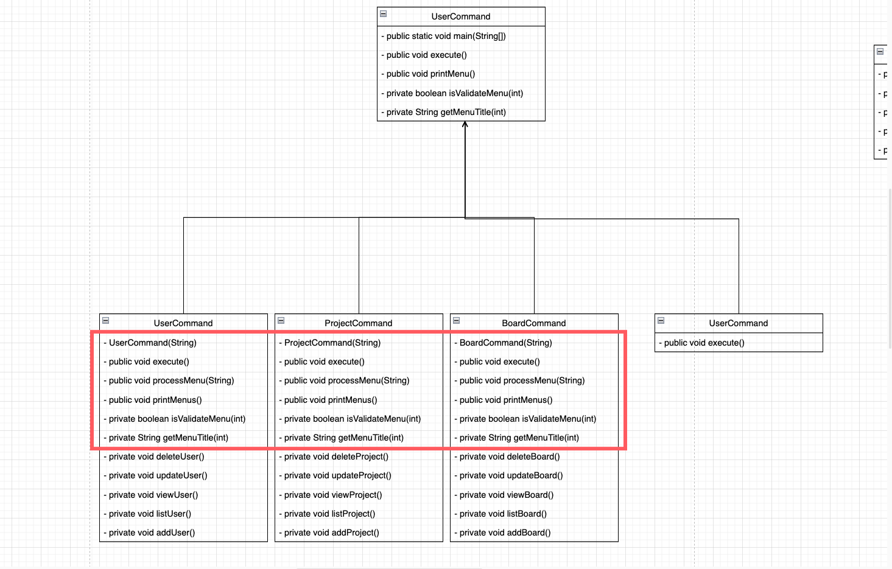
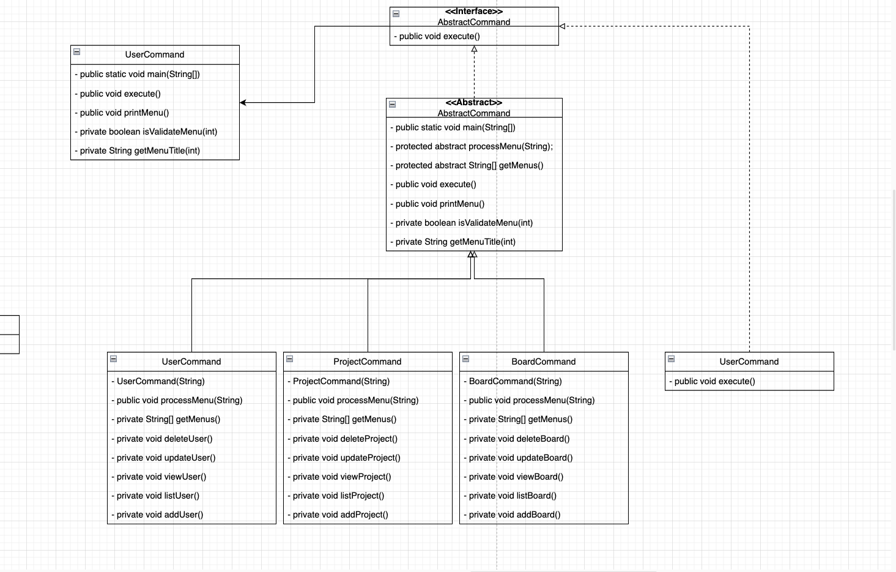

# UML
## UML이란?
- 

## UML case
- UML은 크게 6가지로 구분  할 수 있다.


# 실습프로젝트 리팩토링하기
## 인터페이스의 활용
- 기존 프로젝트의 List 항목들에서 중복된 코드를 줄이자.
- 다음가 같은 UML을 가지도록 수정 한다.

<p align ="center">

</p>

- 먼저 ArrayList와 LinkedList의 공통 코드를 추상 메소드(pulic abstract)로 선언한다.
    ``` java 
    //List 인터페이스
    public interface List {
      void add(Object obj);

      Object remove(int index);

      Object[] toArray();

      int indexOf(Object obj);

      int size();

      Object get(int index);
    }
    ```

- 다음 ArrayList와 LinkedList의 동일한 코드를 Abstract class로 오버라이딩을 한다.

  ```java 
  public abstract class AbstractList implements List {
    protected int size = 0;

    @Override
    public int size() {
      return size;
    }
  }
  ```

- 이후 ArrayList와 LinkedList의 상세코드를 오버라이딩으로 수정한다.
- ArrayList의 상세코드
  <details>
  <summary> 코드 접기/펴기</summary>

  ```java
  public class ArrayList extends AbstractList {
    private static final int MAX_SIZE = 3;
    private Object[] list = new Object[MAX_SIZE];
    private int size = 0;

    @Override
    public void add(Object obj) {
      if (size == list.length) {
        int oldSize = list.length;
        int newSize = oldSize + (oldSize >> 1);
        list = Arrays.copyOf(list, newSize);
      }
      list[size++] = obj;
    }

    @Override
    public Object remove(int index) {
      if (index < 0 || index >= size) {
        return null;
      }
      Object deletedObj = list[index];
      for (int i = index + 1; i < size; i++) {
        list[i - 1] = list[i];
      }
      list[--size] = null;
      return deletedObj;
    }

    @Override
    public Object[] toArray() {
      Object[] arr = new Object[size];
      System.arraycopy(list, 0, arr, 0, arr.length);
      return arr;
    }

    @Override
    public int indexOf(Object obj) {
      for (int i = 0; i < size; i++) {
        if (list[i] == obj) {
          return i;
        }
      }
      return -1;
    }

    @Override
    public int size() {
      return size;
    }

    @Override
    public Object get(int index) {
      if (index < 0 || index >= size) {
        return null;
      }
      java.util.ArrayList l;
      return list[index];
    }

    public boolean contains(Object obj) {
      return indexOf(obj) != -1;
    }
  }
  ```
  </details>

- LinkedList의 상세코드

  <details>
  <summary> 코드 접기/펴기</summary>

  ```java
    public class LinkedList extends AbstractList {

    Node first;
    Node last;
    int size;

    @Override
    public void add(Object value) {
      Node newNode = new Node(value);

      if (first == null) {
        last = first = newNode;
      } else {
        last.next = newNode;
        last = newNode;
      }
      size++;
    }

    @Override
    public Object get(int index) {
      if (index < 0 || index >= size) {
        return null;
      }

      Node cursor = first;
      int currentIndex = 0;

      while (cursor != null) {
        if (currentIndex == index) {
          return cursor.value;
        }
        cursor = cursor.next;
        currentIndex++;
      }
      return null;
    }

    @Override
    public Object remove(int index) {
      if (index < 0 || index >= size) {
        return null;
      }

      Node deletedNode = null;
      size--;

      if (index == 0) {
        deletedNode = first;
        first = first.next;
        if (first == null) {
          last = null;
        }
        return deletedNode.value;
      }

      Node cursor = first;
      int currentIndex = 0;

      while (cursor != null) {
        if (currentIndex == (index - 1)) {
          break;
        }
        cursor = cursor.next;
        currentIndex++;
      }

      deletedNode = cursor.next;
      cursor.next = cursor.next.next;

      if (cursor.next == null) {
        last = cursor;
      }

      return deletedNode.value;
    }

    @Override
    public int indexOf(Object value) {
      Node cursor = first;
      int currentIndex = 0;

      while (cursor != null) {
        if (cursor.value == value) {
          return currentIndex;
        }
        cursor = cursor.next;
        currentIndex++;
      }
      return -1;
    }

    @Override
    public Object[] toArray() {
      Object[] arr = new Object[size];

      Node cursor = first;
      for (int i = 0; i < size; i++) {
        arr[i] = cursor.value;
        cursor = cursor.next;
      }

      return arr;
    }

    @Override
    public int size() {
      return size;
    }
    }
    ```
  </details>


## 리팩토링: GRASP의 High Cohesion
- High Cohesion :  응집력은 클래스나 모듈의 내부 요소들이 얼마나      밀접하게 관련되어 있는지를 나타내는 개념
- 관련성 높은 기능들의 집합
- 유지보수성 향상
- 재사용성 향상
- 객체지향 원칙 준수

### App과 Command 코드 수정
- App에 subMenus에서 수행하는 기능들 혼재
- APP에 있는 subMenus들의 기능을 각 Command 기능으로 옮기기


- App()코드수정
  <details>
  <summary> 코드 접기/펴기</summary>

  ```java 
  public class App {
    
    String[] mainMenus = new String[] {"회원", "프로젝트", "게시판", "공지사항", "도움말", "종료"};
    UserCommand userCommand = new UserCommand("회원");
    BoardCommand boardCommand = new BoardCommand("게시판");
    BoardCommand noticeCommand = new BoardCommand("공지사항");
    ProjectCommand projectCommand = new ProjectCommand("프로젝트", userCommand.getUserList());
    public static void main(String[] args) {
      new App().execute();
    }

    void execute() {
        //생략
    }

    void processMenu(String menuTitle) {
      switch (menuTitle) {
        case "회원":
          userCommand.execute();
          break;
        case "프로젝트":
          projectCommand.execute();
          break;
        case "게시판":
          boardCommand.execute();
          break;
        case "공지사항":
          noticeCommand.execute();
          break;
        case "도움말":
          System.out.println("도움말입니다.");
          break;
        default:
          System.out.printf("%s 메뉴의 명령을 처리할 수 없습니다.\n", menuTitle);
      }
    }

    void printMenu() {
        //생략
    }
    
    boolean isValidateMenu(int menuNo, String[] menus) {
        //생략
    }

    String getMenuTitle(int menuNo, String[] menus) {
        //생략
    }
  }
  ```
  </details>

- Command()인터페이스 생성
  ```java
  public interface Command {
    void execute();
  }
  ```

- Command()코드수정
  <details>
  <summary> 코드 접기/펴기</summary>

  ```java
  public class UserCommand implements Command {

    LinkedList userList = new LinkedList();

    String menuTitle;
    String[] menus = {"등록", "목록", "조회", "변경", "삭제"};

    public UserCommand(String menuTitle) {
      this.menuTitle = menuTitle;
    }

    @Override
    public void execute() {
      printMenus();
      while (true) {
        String command = Prompt.input(String.format("메인/%s>", menuTitle));
        if (command.equals("menu")) {
          printMenus();
          continue;
        } else if (command.equals("9")) { // 이전 메뉴 선택
          break;
        }
        try {
          int menuNo = Integer.parseInt(command);
          String menuName = getMenuTitle(menuNo);
          if (menuName == null) {
            System.out.println("유효한 메뉴 번호가 아닙니다.");
            continue;
          }
          processMenu(menuName);
        } catch (NumberFormatException ex) {
          System.out.println("숫자로 메뉴 번호를 입력하세요.");
        }
      }
    }

    private void processMenu(String menuName) {
      System.out.printf("[%s]\n", menuName);
      switch (menuName) {
        case "등록":
          this.addUser();
          break;
        case "조회":
          this.viewUser();
          break;
        case "목록":
          this.listUser();
          break;
        case "변경":
          this.updateUser();
          break;
        case "삭제":
          this.deleteUser();
          break;
      }
    }

    private void printMenus() {
      System.out.printf("[%s]\n", menuTitle);
      for (int i = 0; i < menus.length; i++) {
        System.out.printf("%d. %s\n", (i + 1), menus[i]);
      }
      System.out.println("9. 이전");
    }

    private boolean isValidateMenu(int menuNo) {
      return menuNo >= 1 && menuNo <= menus.length;
    }

    private String getMenuTitle(int menuNo) {
      return isValidateMenu(menuNo) ? menus[menuNo - 1] : null;

    }
  }
  ```
  </details>

## 리팩토링: 상속의 Generalization 적용
- 응집력을 높인 결과 각 Command 클래스에 동일한 코드 생성


- 동일한 코드를 일반화를 통해 하나의 클래스에 넣는다.
- 상속을 사용하여 일반화를 진행한다. 
- 수퍼클래스를 추상클래스로 설정하여 직접적인 클래스 사용을 막는다.
- 수퍼클래스에서 결정되지 못하는 메소드는 추상메소드로 만든다.
- 자식클래스에서 추상메소드에 방법을 제시해야한다. 




- 추상클래스를 상속받은 UserCommand
  <details>
  <summary> 코드 접기/펴기</summary>

  ```java
    public class UserCommand extends AbstractCommand {

    LinkedList userList = new LinkedList();

    String menuTitle;
    String[] menus = {"등록", "목록", "조회", "변경", "삭제"};

    public UserCommand(String menuTitle) {
      super(menuTitle);
    }

    @Override
    public void processMenu(String menuName) {
      System.out.printf("[%s]\n", menuName);
      switch (menuName) {
        case "등록":
          this.addUser();
          break;
        case "조회":
          this.viewUser();
          break;
        case "목록":
          this.listUser();
          break;
        case "변경":
          this.updateUser();
          break;
        case "삭제":
          this.deleteUser();
          break;
      }
    }

    @Override
    public String[] getMenus() {
      return menus;
    }

    private void addUser() {
      User user = new User();
      user.setName(Prompt.input("이름?"));
      user.setEmail(Prompt.input("이메일?"));
      user.setPassword(Prompt.input("암호?"));
      user.setTel(Prompt.input("연락처?"));
      user.setNo(User.getNextSeqNo());
      userList.add(user);
    }

    private void listUser() {
      System.out.println("번호 이름 이메일");
      for (Object obj : userList.toArray()) {
        User user = (User) obj;
        System.out.printf("%d %s %s\n", user.getNo(), user.getName(), user.getEmail());
      }
    }

    private void viewUser() {
      int userNo = Prompt.inputInt("회원번호?");
      User user = (User) userList.get(userList.indexOf(new User(userNo)));
      if (user == null) {
        System.out.println("없는 회원입니다.");
        return;
      }

      System.out.printf("이름: %s\n", user.getName());
      System.out.printf("이메일: %s\n", user.getEmail());
      System.out.printf("연락처: %s\n", user.getTel());
    }

    private void updateUser() {
      int userNo = Prompt.inputInt("회원번호?");
      User user = (User) userList.get(userList.indexOf(new User(userNo)));
      if (user == null) {
        System.out.println("없는 회원입니다.");
        return;
      }

      user.setName(Prompt.input("이름(%s)?", user.getName()));
      user.setEmail(Prompt.input("이메일(%s)?", user.getEmail()));
      user.setPassword(Prompt.input("암호?"));
      user.setTel(Prompt.input("연락처(%s)?", user.getTel()));
      System.out.println("변경 했습니다.");
    }

    private void deleteUser() {
      int userNo = Prompt.inputInt("회원번호?");
      User deletedUser = (User) userList.get(userList.indexOf(new User(userNo)));
      if (deletedUser != null) {
        userList.remove(userList.indexOf(deletedUser));
        System.out.printf("'%s' 회원을 삭제 했습니다.\n", deletedUser.getName());
      } else {
        System.out.println("없는 회원입니다.");
      }
    }

    public LinkedList getUserList() {
      return userList;
    }

  }
  ```
  </details>

- 추상클래스를 상속받은 ProjectCommand
  <details>
  <summary> 코드 접기/펴기</summary>

  ```java
  public class ProjectCommand extends AbstractCommand {

    LinkedList projectList = new LinkedList();
    LinkedList userList;

    String menuTitle;
    String[] menus = {"등록", "목록", "조회", "변경", "삭제"};

    public ProjectCommand(String menuTitle, LinkedList userList) {
      super(menuTitle);
      this.userList = userList;
    }

    @Override
    public void processMenu(String menuName) {
      System.out.printf("[%s]\n", menuName);
      switch (menuName) {
        case "등록":
          this.addProject();
          break;
        case "조회":
          this.viewProject();
          break;
        case "목록":
          this.listProject();
          break;
        case "변경":
          this.updateProject();
          break;
        case "삭제":
          this.deleteProject();
          break;
      }
    }

    @Override
    public String[] getMenus() {
      return menus;
    }

    private void addMembers(Project project) {
      while (true) {
        int userNo = Prompt.inputInt("추가할 팀원 번호?(종료: 0)");
        if (userNo == 0) {
          break;
        }

        User user = (User) userList.get(userList.indexOf(new User(userNo)));
        if (user == null) {
          System.out.println("없는 팀원입니다.");
          continue;
        }

        if (project.getMembers().contains(user)) {
          System.out.printf("'%s'은 현재 팀원입니다.\n", user.getName());
          continue;
        }

        project.getMembers().add(user);
        System.out.printf("'%s'을 추가했습니다.\n", user.getName());
      }
    }

    private void deleteMembers(Project project) {
      for (int i = 0; i < project.getMembers().size(); i++) {
        User user = (User) project.getMembers().get(i);
        String str = Prompt.input("팀원(%s) 삭제?", user.getName());
        if (str.equalsIgnoreCase("y")) {
          project.getMembers().remove(i);
          System.out.printf("'%s' 팀원을 삭제합니다.\n", user.getName());
        } else {
          System.out.printf("'%s' 팀원을 유지합니다.\n", user.getName());
        }
      }
    }

    private void addProject() {
      Project project = new Project();
      project.setTitle(Prompt.input("프로젝트명?"));
      project.setDescription(Prompt.input("설명?"));
      project.setStartDate(Prompt.input("시작일?"));
      project.setEndDate(Prompt.input("종료일?"));

      System.out.println("팀원:");
      addMembers(project);

      project.setNo(Project.getNextSeqNo());

      projectList.add(project);

      System.out.println("등록했습니다.");
    }

    private void listProject() {
      System.out.println("번호 프로젝트 기간");
      for (Object obj : projectList.toArray()) {
        Project project = (Project) obj;
        System.out.printf("%d %s %s ~ %s\n", project.getNo(), project.getTitle(),
            project.getStartDate(), project.getEndDate());
      }
    }

    private void viewProject() {
      int projectNo = Prompt.inputInt("프로젝트 번호?");
      Project project = (Project) projectList.get(projectList.indexOf(new Project(projectNo)));
      if (project == null) {
        System.out.println("없는 프로젝트입니다.");
        return;
      }

      System.out.printf("프로젝트명: %s\n", project.getTitle());
      System.out.printf("설명: %s\n", project.getDescription());
      System.out.printf("기간: %s ~ %s\n", project.getStartDate(), project.getEndDate());
      System.out.println("팀원:");
      for (int i = 0; i < project.getMembers().size(); i++) {
        User user = (User) project.getMembers().get(i);
        System.out.printf("- %s\n", user.getName());
      }
    }

    private void updateProject() {
      int projectNo = Prompt.inputInt("프로젝트 번호?");
      Project project = (Project) projectList.get(projectList.indexOf(new Project(projectNo)));
      if (project == null) {
        System.out.println("없는 프로젝트입니다.");
        return;
      }

      project.setTitle(Prompt.input("프로젝트명(%s)?", project.getTitle()));
      project.setDescription(Prompt.input("설명(%s)?", project.getDescription()));
      project.setStartDate(Prompt.input("시작일(%s)?", project.getStartDate()));
      project.setEndDate(Prompt.input("종료일(%s)?", project.getEndDate()));

      System.out.println("팀원:");
      deleteMembers(project);
      addMembers(project);

      System.out.println("변경 했습니다.");
    }

    private void deleteProject() {
      int projectNo = Prompt.inputInt("프로젝트 번호?");
      Project deletedProject = (Project) projectList.get(projectList.indexOf(new Project(projectNo)));
      if (deletedProject != null) {
        projectList.remove(projectList.indexOf(deletedProject));
        System.out.printf("%d번 프로젝트를 삭제 했습니다.\n", deletedProject.getNo());
      } else {
        System.out.println("없는 프로젝트입니다.");
      }
    }
  }
  ```
  </details>

- 추상클래스를 상속받은 BoardCommand
  <details>
  <summary> 코드 접기/펴기</summary>

  ```java
  public class BoardCommand extends AbstractCommand {

    LinkedList boardList = new LinkedList();

    String menuTitle;
    String[] menus = {"등록", "목록", "조회", "변경", "삭제"};

    public BoardCommand(String menuTitle) {
      super(menuTitle);
    }

    @Override
    public void processMenu(String menuName) {
      System.out.printf("[%s]\n", menuName);
      switch (menuName) {
        case "등록":
          this.addBoard();
          break;
        case "조회":
          this.viewBoard();
          break;
        case "목록":
          this.listBoard();
          break;
        case "변경":
          this.updateBoard();
          break;
        case "삭제":
          this.deleteBoard();
          break;
      }
    }

    @Override
    public String[] getMenus() {
      return menus;
    }
    private void deleteBoard() {
      int boardNo = Prompt.inputInt("게시글 번호?");
      Board deletedBoard = (Board) boardList.get(boardList.indexOf(new Board(boardNo)));
      if (deletedBoard != null) {
        boardList.remove(boardList.indexOf(deletedBoard));
        System.out.printf("%d번 게시글을 삭제 했습니다.\n", deletedBoard.getNo());
      } else {
        System.out.println("없는 게시글입니다.");
      }
    }

    private void updateBoard() {
      int boardNo = Prompt.inputInt("게시글 번호?");
      Board board = (Board) boardList.get(boardList.indexOf(new Board(boardNo)));
      if (board == null) {
        System.out.println("없는 게시글입니다.");
        return;
      }

      board.setViewCount(board.getViewCount() + 1);
      board.setTitle(Prompt.input("제목(%s)?", board.getTitle()));
      board.setContent(Prompt.input("내용(%s)?", board.getContent()));
      System.out.println("변경 했습니다.");
    }

    private void viewBoard() {
      int boardNo = Prompt.inputInt("게시글 번호?");
      Board board = (Board) boardList.get(boardList.indexOf(new Board(boardNo)));
      if (board == null) {
        System.out.println("없는 게시글입니다.");
        return;
      }

      board.setViewCount(board.getViewCount() + 1);
      System.out.printf("제목: %s\n", board.getTitle());
      System.out.printf("내용: %s\n", board.getContent());
      System.out.printf("작성일: %1$tY-%1$tm-%1$td %1$tH:%1$tM:%1$tS\n", board.getCreatedDate());
      System.out.printf("조회수: %d\n", board.getViewCount());
    }

    private void listBoard() {
      System.out.println("번호 제목 작성일 조회수");
      for (Object obj : boardList.toArray()) {
        Board board = (Board) obj;
        System.out.printf("%d %s %tY-%3$tm-%3$td %d\n", board.getNo(), board.getTitle(),
            board.getCreatedDate(), board.getViewCount());
      }
    }

    private void addBoard() {
      Board board = new Board();
      board.setTitle(Prompt.input("제목?"));
      board.setContent(Prompt.input("내용?"));
      board.setCreatedDate(new Date());
      board.setNo(Board.getNextSeqNo());
      boardList.add(board);
    }

  }
  ```
  </details>

- HelpCommand
  - help커맨드는 인터페이스를 사용하여 직접구현
  ```java
    public class HelpCommand {
    public void execute() {
      System.out.println("도움말 입니다.");
    }
  }
  ```